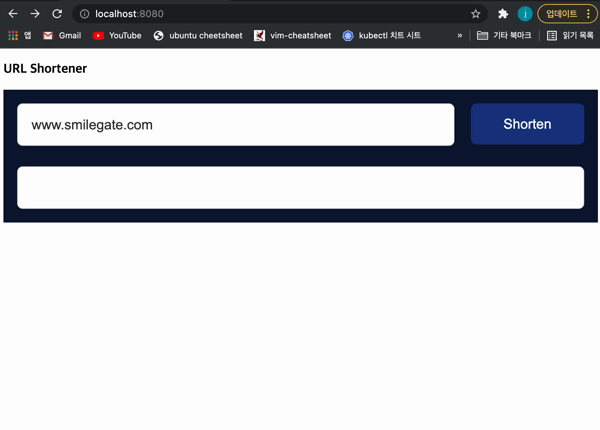
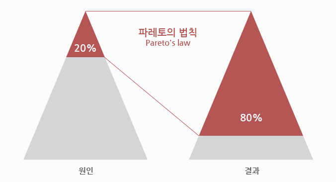
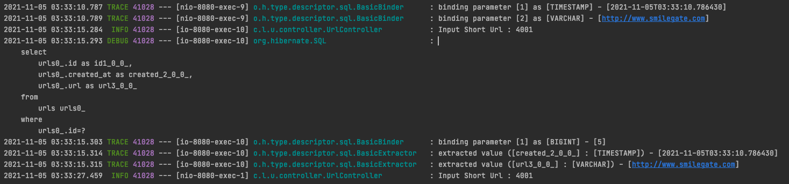

# Url-Shortener

## How To Run
```
// docker와 docker-compose가 설치되어있음을 가정
// docker pull limm0jk/url-shortener:0.0.1
docker-compose up
```
**✋ 배포 환경에서 사용 시, application.yml의 service.host값을 환경에 맞게 변경해주셔야 합니다.**
## Spec
- 웹 페이지 입력폼에 URL 입력 시 단축된 결과 출력
- 브라우저의 주소창에 단축 URL 입력 시 기존 URL로 리다이렉트
- 같은 URL 입력 시 동일한 결과값 도출
- 결과값은 주소를 제외하고 8글자 이내로 생성

## Feature
### 단축 url 생성


### 같은 url 생성 요청시 같은 short url 반환


### 옳지 않은 short Url 사용 시 Alert을 띄우고 Home으로 이동


## Docs
### Encode
- 효율적인 사용을 위하여 문자열을 포함한 인코딩을 고민
- 값을 구별할 수 있는 id 값은 db의 id로 사용
- base64는 문제가 되는 문자가 존재하므로, 이를 제외한 base62를 사용

### Exception
- InvalidShortUrl / InvalidUrl / UrlNotFound Exception 세가지로 정의하여 관리
- adviceController를 이용하여 Exception Handling
- alert창으로 Exception을 알림

### Database  
Urls Table은 id, url, createdAt 세가지 컬럼으로 구성
- url에 unique 제약조건
- 1개만 존재해야하며, create 시 존재하는지 확인해야하므로 indexing 용도 또한 있음.

### Cache
  
- 20%의 원인으로 인하여 80%의 결과가 발생한다는 파레토의 법칙에 의거, Short URL을 converting 하는 작업에 cache가 필요하다 판단.
- spring boot의 cache 의존성을 통하여 구현

 
다음과 같이 2번째 요청은 쿼리를 요청하지 않는 것을 알 수 있다.  
